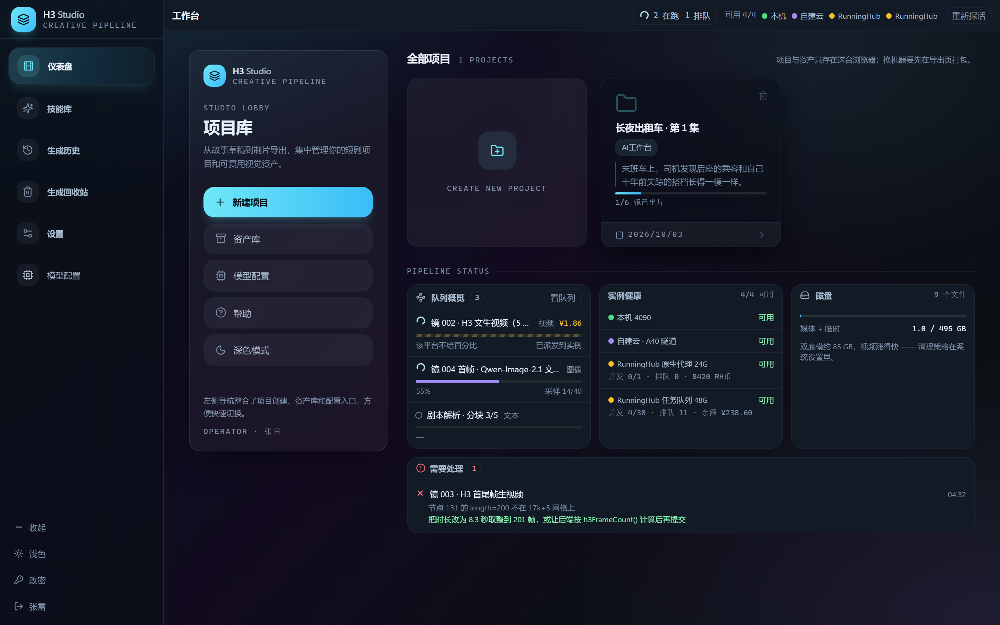
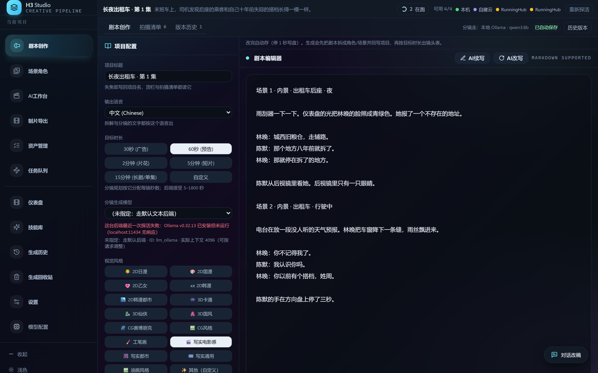
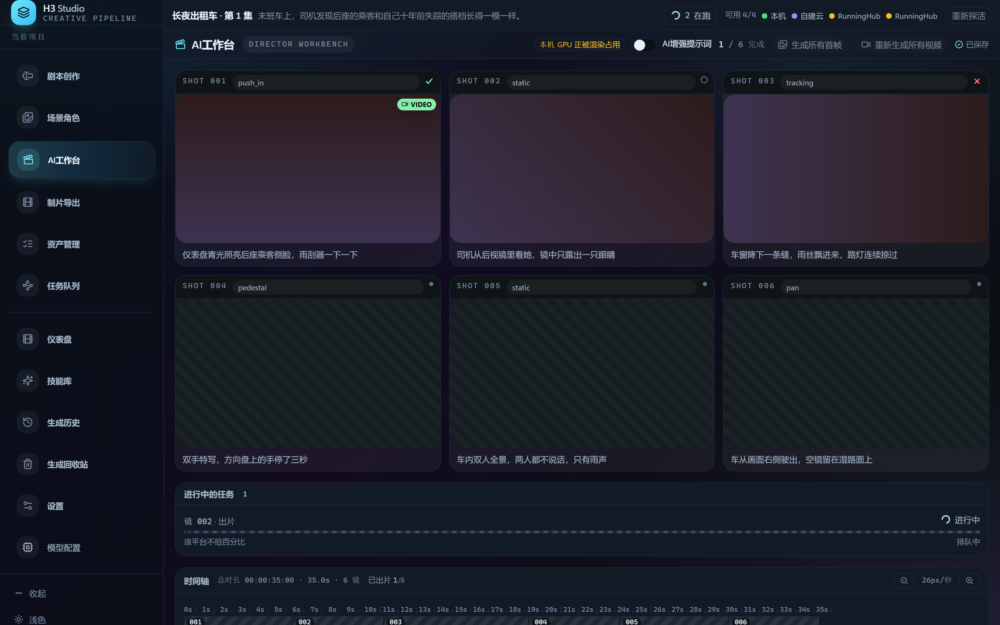
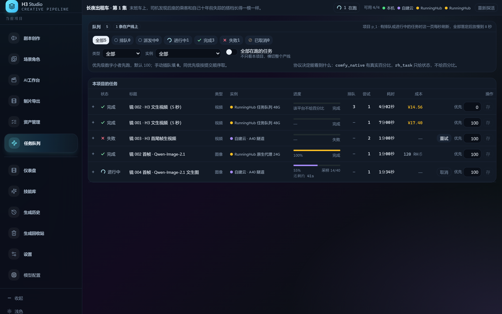
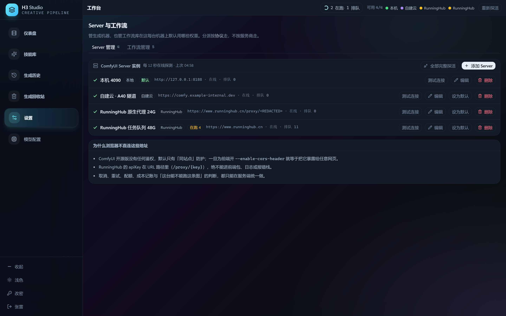
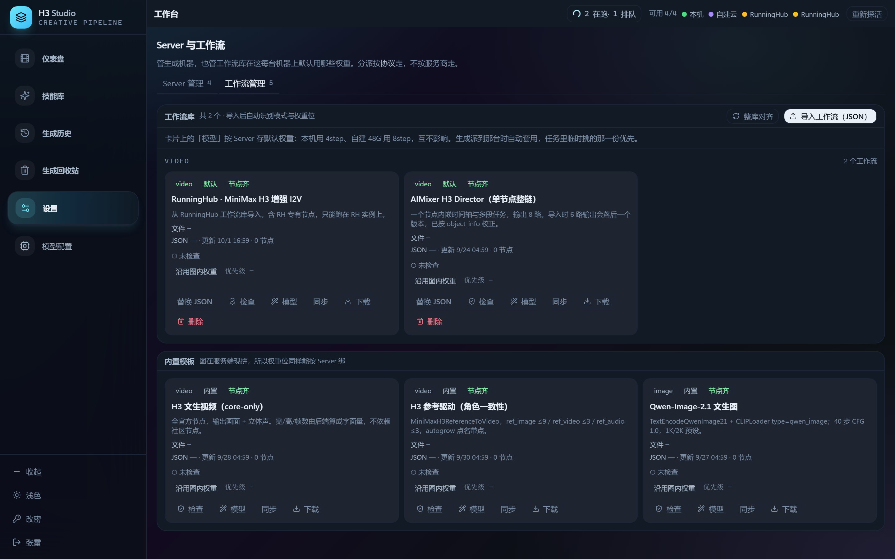
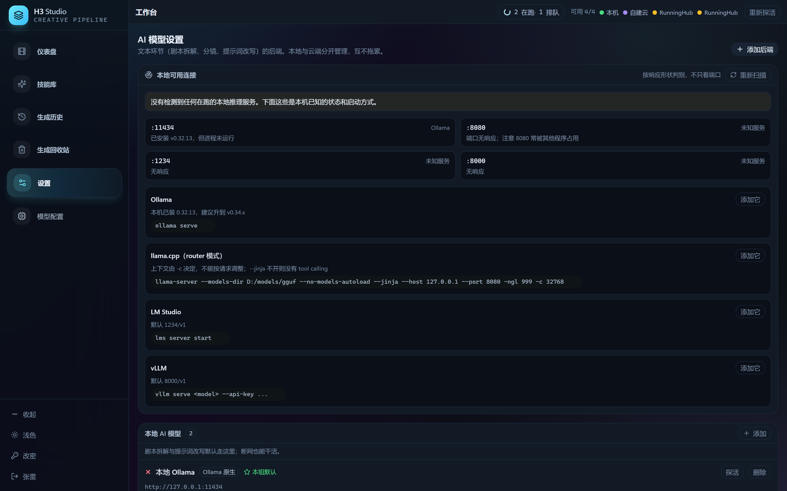

# H3 Studio 工作流包（`work/`）

`work/` 是 H3 Studio 的**工作流交付物**：项目跑起来真正会用的 7 张 ComfyUI 图，连元数据一起从运行中的
工作流库里导出成文件，换一台机器、重装一次系统都能原样导回来。
本项目基于此链接开源项目改进，请给作者点一个Starred，https://github.com/bo961386926/manga-studio.git

ComfyUI 本体、自定义节点包和模型权重**都不在这里**——本仓库不携带任何 ComfyUI 版本，
`work/` 只放图 JSON 与清单。

## 界面与功能

> 下面 7 张截图跑在**演示夹具**（`VITE_USE_MOCK=true`，项目《长夜出租车 · 第 1 集》）上，
> 界面、交互与文案都是真的，项目内容不是。

### 项目面板 `/`



左栏是入口卡（新建项目、资产库、模型配置、深浅色）；右侧「全部项目」每张卡片带当前阶段与出片进度。
下半屏三块实时状态——**队列概览**（在跑/排队的任务）、**实例健康**（每台 ComfyUI 的在线与排队数）、
**磁盘**（媒体与临时文件占用），最底下「需要处理」把失败任务和可执行的修法一起列出来。

### 剧本创作 `/p/:id/script`



左边项目配置（标题、输出语言、目标时长档位、分镜模型、视觉风格），右边剧本编辑器，**改完自动存盘**。
「生成」这一步先把剧本拆成角色与场景并回写项目，再按目标时长分配镜头表；另有 AI 续写、改写与对话改稿。
模型那一栏的探活结果会直接写在字段下面（例图里那句「已安装但未运行」就是真探测，不是占位文案）。

### AI 工作台（导演台）`/p/:id/director`



逐镜头卡片：运镜方式、首末帧、提示词、出片状态（完成 / 进行中 / 失败一眼可分），底部**时间轴**按秒排开整集。
顶部批量入口是「生成所有首帧」与「重新生成所有视频」，旁边实时显示本机 GPU 是否正被渲染占用、
以及「AI 增强提示词」开关与已保存状态。

### 任务队列 `/p/:id/queue`



任务在服务端排队，关掉页面照样跑完。表格给出状态、类型、实例、进度、排队位次、尝试次数、耗时与成本，
可按状态 / 类型 / 实例过滤，也能插队改优先级、重试、取消。页面上那句「协议决定能看到什么」是真的：
`comfy_native` 有真实百分比，`rh_task` 只回状态不给百分比。

### 设置 · Server 管理 `/settings/gen`



登记生成机器：本机 ComfyUI、自建云、RunningHub 代理或任务队列，每 12 秒在线探测，支持测试连接、
设为默认、删除。下面那段「为什么浏览器不直连这些地址」是这站的硬约束——ComfyUI 只有同站点防护、
RunningHub 的 apiKey 在 URL 路径里，所以一切经后端转发。

### 设置 · 工作流管理（同页第二个 tab）



**本仓库 `work/` 包导入后就是这页的样子**。上半是工作流库（导入的条目），下半是内置模板；
每张卡片可以替换 JSON、体检、按 Server 绑默认权重、同步、下载。右上角「导入工作流（JSON）」
就是 `work/import_workflows.py` 走的那条路，「整库对齐」按当前实例的 `/object_info` 重算权重位。

### 设置 · 模型配置 `/settings/llm`



文本环节（剧本拆解、分镜、提示词改写）的后端在这里管：本地端口扫描按**响应形状**判别而不只看端口，
给出 Ollama / llama.cpp / LM Studio / vLLM 的启动命令；本地与云端分开管理，互不拖累，
断网时本地模型仍能干完活。

## 目录内容

```
work/
├── manifest.json                 # 清单：每条工作流的元数据 + 所需权重 + 所需自定义节点
├── import_workflows.py           # 批量导入器（只用标准库，不需要装依赖）
├── export_from_library.py        # 反向：把工作流库里的条目导出回这个包
├── workflows/                    # 7 条 × (api 版 + 画布版)
│   ├── h3-firstlast-fast.api.json      / .ui.json
│   ├── h3-motion-ref-omni.api.json     / .ui.json
│   ├── h3-drama-omni-ref.api.json      / .ui.json
│   ├── h3-omni-ref-60s-stitch.api.json / .ui.json
│   ├── voice-clone-qwen3-tts.api.json  / .ui.json
│   ├── klein-character-sheet.api.json  / .ui.json
│   └── klein-instruct-edit.api.json    / .ui.json
```

`.api.json` 是**本机能直接执行的那一份**（作者私有节点已换成 ComfyUI 核心等价节点、权重名已对齐）；
`.ui.json` 是画布版，给工作流库的编辑器用。两份一起交给导入向导，可以省掉一次有损的 UI↔API 往返。
作者原始导出与逐条改写清单不在包里，它们在数据库 `workflows.graph_original` / `adaptations` 两列。

## 包内 7 条

| slug | 名称 | 种类 | 优先级 | 节点/槽位 | 导出时已试跑 |
|---|---|---|---:|---:|---|
| `h3-firstlast-fast` | MiniMax H3 图文一键生视频（加速版） | video | 120 | 20 / 30 | 是 |
| `h3-motion-ref-omni` | MiniMax H3 动作迁移·全能参考 | video | 110 | 21 / 31 | 是 |
| `h3-drama-omni-ref` | 双模双采短剧助手·全能参考生成视频 | video | 100 | 41 / 59 | 否 |
| `h3-omni-ref-60s-stitch` | MiniMax H3 全能参考 60 秒·多素材拼接 | video | 90 | 58 / 101 | 否 |
| `voice-clone-qwen3-tts` | 声音克隆二合一（IndexTTS2 + Qwen3-TTS） | audio | 120 | 6 / 26 | 是 |
| `klein-character-sheet` | Klein 一键人物设定图 + 服装拆解 | image | 120 | 22 / 26 | 是 |
| `klein-instruct-edit` | Klein 指令编辑（FLUX） | image | 110 | 23 / 23 | 是 |

优先级决定同类任务里谁先被「按任务自动选」挑中：越轻越具体的越靠前，60 秒多素材拼接那种重活儿
留给人手动选（也可以在工作流库里直接把它的自动选关掉）。

## 三条内置工作流不在包里

它们由后端代码现场生成，不落 JSON 文件（定义在 `apps/api/app/gen/builtin_graphs.py` 与 `templates.py`）：

| id | 名称 | 说明 |
|---|---|---|
| `builtin:qwen_image` | Qwen-Image 出图 | 文生图；带参考图时同一节点做角色一致性编辑 |
| `builtin:h3_video` | MiniMax H3 出片 | t2v / i2v / fl2v 三合一，导演台逐镜头出片走它 |
| `builtin:h3_chain` | MiniMax H3 长片续拍 | 依赖自定义节点 `H3SeamlessChainSampler`（ComfyUI-minimaxH3-SequenceForge） |

内置这三条的权重名**不写死**：运行时从实例的 `/object_info` 里按归一化模糊匹配挑（例如
`qwenimage21int8convrot` 优先，回落 `…bf16`）。而包里这 7 条走的是导入向导的权重对齐，
**不做近似匹配**——文件名必须一字不差地存在于目标实例，否则会明确报缺，不会悄悄换个像的顶上。

## 导入步骤

前置：后端在跑（默认 `http://127.0.0.1:8788`），并且**至少有一台在线的生成实例**——导入向导要拿它的
`/object_info` 校验节点、对齐权重、算出缺口。

```powershell
# 1) 看计划，不动库
python work/import_workflows.py --dry-run

# 2) 全导（同名默认跳过）
python work/import_workflows.py --username admin --password 12345

# 其它常用开关
python work/import_workflows.py --token h3_xxx --only h3-     # 用 agent token，只导 H3 那几条
python work/import_workflows.py --instance 597 --replace      # 指定实例；同名先删后加
python work/import_workflows.py --fresh                       # 先清空库里所有非内置条目再导
```

不想用脚本，单条走 CLI 也行：

```powershell
h3 workflow import work/workflows/klein-instruct-edit.api.json `
  --ui-file work/workflows/klein-instruct-edit.ui.json `
  --name "Klein 指令编辑（FLUX）" --tags "导入,图片,指令编辑" --priority 110
```

或在界面里：**工作流库 → 导入工作流**，把 `.api.json` 和 `.ui.json` 两个文件一起拖进去。

导入返回的报告要逐条看：`gaps`（本机还缺的节点/权重）非空就是跑不了，`adaptations` 是本机做的等价改写，
`warnings` 里通常是权重名对齐提示。

## 这 7 条要什么东西

### 权重（`<ComfyUI>/models/` 下）

| 目录 | 文件 | 被谁用 |
|---|---|---|
| `unet/` | `MiniMax_H3_FL2VA_pruned_int8_convrot.safetensors` | h3-firstlast-fast |
| `unet/` | `MiniMax_H3_Ref2VA_pruned_int8_convrot.safetensors` | 另 3 条 H3 |
| `unet/` | `flux-2-klein-base-9b.safetensors` | 两条 Klein |
| `clip/` | `qwen3vl_32b_minimax_h3_int8_convrot.safetensors` | 4 条 H3 |
| `clip/` | `qwen_3_8b.safetensors` | 两条 Klein |
| `vae/` | `minimax_h3_video_vae_fp16.safetensors`、`minimax_h3_audio_vae_fp32.safetensors` | 4 条 H3 |
| `vae/` | `flux2-vae.safetensors` | 两条 Klein |
| `loras/` | `minimax_h3_ref2v_turbo_4step_v0.1_comfyui_bf16.safetensors` | drama / 60s-stitch |
| `stt/whisper/` | `large-v3.pt` | voice-clone-qwen3-tts |
| `qwen-tts/` | `Qwen3-TTS-12Hz-0.6B-Base`、`Qwen3-TTS-12Hz-0.6B-CustomVoice`、`Qwen3-TTS-Tokenizer-12Hz` | voice-clone-qwen3-tts |

内置的 Qwen-Image 出图另需 `diffusion_models/qwen_image_2.1_*.safetensors`、
`clip/qwen3vl_8b_*.safetensors`、`vae/qwen_image_2.1_vae_*.safetensors`。

### 自定义节点包

包里 7 条只有 `voice-clone-qwen3-tts` 需要装节点包（其余的专有节点都已在导入时被等价改写成核心节点）：

| 目录名 | 提供节点 | Python 依赖 |
|---|---|---|
| `ComfyUI-Whisper` | `Apply Whisper` | `openai-whisper`、`pillow`、`uuid`、`soundfile` |
| `ComfyUI-Qwen-TTS` | `FB_Qwen3TTSVoiceClone` | `torch`、`torchaudio`、`transformers>=4.57.0`、`librosa`、`soundfile`、`accelerate`、`einops`、`tiktoken`、`sentencepiece`、`sox`、`huggingface_hub` |

内置的长片续拍另需 `ComfyUI-minimaxH3-SequenceForge`（`H3SeamlessChainSampler` / `H3SeamDoctor`，零额外 Python 依赖）。

### ComfyUI 版本

这些图用到 `MiniMaxH3*`、`EasyCache`、`ComfyMathExpression`、`QwenImage21Cache`、`EmptyFlux2LatentImage`、
`Flux2Scheduler`、`SaveAudioMP3`、`TrimAudioDuration` 等核心节点，**以 ComfyUI 0.37.4 为实测基线**才齐。
版本太老会在导入体检时报 unknown node，而不是跑一半才失败。

## 校验与重导

导入 ≠ 跑通。逐条到**工作流库 → 试运行**（真占显存）跑一次，成功才会写 `verifiedAt`。
换 ComfyUI 版本或补装节点包后，用**重扫**（`h3 workflow rescan <id>`）按新的 `/object_info` 重算槽位与缺口。

`work/` 自带一对脚本，包是能自己维护的：

```powershell
# 库里改了元数据 / 重扫了图 → 重新导出（--keep-slugs 沿用现有文件名）
python work/export_from_library.py --keep-slugs --comfyui <某份 ComfyUI 源码目录>

# 换机器 / 重装 → 导回来
python work/import_workflows.py --username admin --password 12345
```

`--comfyui` 指一份 ComfyUI 源码才填得出 `customNodes`（在 `comfy_extras` / `nodes*.py` / `comfy_api`
里找不到的类名就算第三方节点）；不给就留空，全部类名仍记在 `nodeClasses` 里。`builtinWorkflows` 与
`prerequisites` 两节是手工维护的，重新导出会原样保留。
